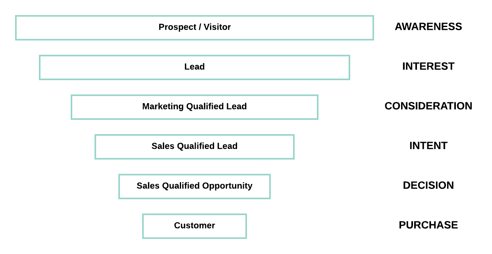

# lead-scoring-model
Classifier model to determine whether a lead will become a sales accepted opportunity

## Problem Statement:

For a B2B SaaS organization, demand generation can result in hundreds of new leads every day. Understanding the quality of leads, and which leads are likely to convert is critical as it enables the sales team to focus their efforts on low-hanging fruit. The typical B2B sales funnel starts with top of funnel metrics such as leads, narrowing as the leads are increasingly qualified and progress to sales opportunities, and potentially closed won deals. 

## Model Overview

The classification goal is to predict whether a lead will become a sales accepted opportunity. This model uses demographic and behavioural information for each lead, and predicts whether the lead will become a sales accepted opportunity (SAO) by classifying the lead as either likely to convert, or not likely to convert. This helps then sales team or business development / sales reps to tailor their attention to the leads with the highest potential to become an opportunity, and eventually revenue. 

## Outcome

The end result of this notebook is a Random Forest Classifier model that predicts whether a lead will become an SAO with over 99% accuracy and 81.5% precision. Given that sales rep time is the constrained resource and leads are plentiful, precision is the key evaluation metric here. A false positive (saying a lead is quality when it is not) is more costly than a false negative (saying a quality lead is not worth working) in this situation.

